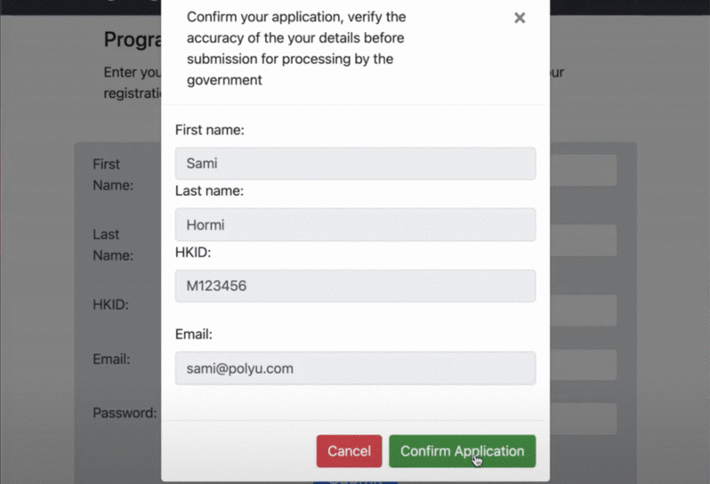

# Vouchain
Blockchain Voucher system for the Hong Kong Governement subsidy programme

## Overview
Issuing vouchers is an alternative means to implement social welfare. While paper-based vouchers are a working method, they are nonetheless susceptible to security troubles such as counterfeiting, reproduction, and a relatively low effectiveness.  

Vouchain is an alternative system that deals with those constrains, by establishing a client/server side funnel, by which governemet entities can authorise users satisfying social status(ie. permanent residents) and operators(eg Alipay, Octopus, PayMe) to redeem vouchers and approve transactions, respectively.  

The properties of this system include but are not limited to: confidentiality, integrity, authenticity, non-reproducibility, non-repudiablity, non-transferability, availability and one-time use.

## Requirements
- Crypto
- hashlib
- Json
- flask 
- Cryptography
- Openssl
- Requests 
- Flask_cors
- Binascii
- Yaml
- Collections

## Installation  

 - Clone the repository
```python
git clone https://github.com/samihormi/Vouchain
```
- Install dependencies
```python
pip install -r requirements.txt
```

## Demo 
 
You can deploy the applications throught the client and server commands under blockchain_client and blochain server respectively.

```python
python blockchain_client.py 
```
```python
python blockchain_server.py 
```
(by default the ports are 8080 and 5000 for client and server respectively)

<div style="display:block;margin:auto;height:80%;width:80%">
  
</div>

## Command Guide
* Client: 
  * In the client server, the user will be prompted for registration. 
  * After the registration is verified, the data will be transferred into the blockchain_server for approval from the government. 
  * Approved users can redeem vouchers by clicking on the use voucher on the navigation bar, however, they can only redeem one voucher per card.   * Users have a total balance of $5,000 HKD. 
  * Users can also see their previous transaction in the view transactions tab. 

* Server:
  * Allow/deny user registration.
  * Approve user registration will generate a bunch of vouchers to the user.

## Acknowledgement
This system was build on top of the great work done in the following projects:
 * http://adilmoujahid.com/posts/2018/03/intro-blockchain-bitcoin-python
 * https://www.mdpi.com/2071-1050/12/8/3362
